```mermaid
flowchart TB
    subgraph current["CfsAlerts.Tests.csproj"]
        MAIN["<b>📦&nbsp;CfsAlerts.Tests.csproj</b><br/><small>net8.0</small>"]
        click MAIN "#cfsalertstestscfsalertstestscsproj"
    end
    subgraph downstream["Dependencies (1"]
        P2["<b>📦&nbsp;CfsAlerts.csproj</b><br/><small>net8.0</small>"]
        click P2 "#cfsalertscfsalertscsproj"
    end
    MAIN --> P2

```

```mermaid
flowchart TB
    subgraph upstream["Dependants (1)"]
        P1["<b>📦&nbsp;CfsAlerts.Tests.csproj</b><br/><small>net8.0</small>"]
        click P1 "#cfsalertstestscfsalertstestscsproj"
    end
    subgraph current["CfsAlerts.csproj"]
        MAIN["<b>📦&nbsp;CfsAlerts.csproj</b><br/><small>net8.0</small>"]
        click MAIN "#cfsalertscfsalertscsproj"
    end
    P1 --> MAIN

```

# Projects and dependencies analysis

This document provides a comprehensive overview of the projects and their dependencies in the context of upgrading to .NET 9.0.

## Table of Contents

- [Projects Relationship Graph](#projects-relationship-graph)
- [Project Details](#project-details)

  - [CfsAlerts.Tests\CfsAlerts.Tests.csproj](#cfsalertstestscfsalertstestscsproj)
  - [CfsAlerts\CfsAlerts.csproj](#cfsalertscfsalertscsproj)
- [Aggregate NuGet packages details](#aggregate-nuget-packages-details)

## Projects Relationship Graph

Legend:
📦 SDK-style project
⚙️ Classic project

```mermaid
flowchart LR
    P1["<b>📦&nbsp;CfsAlerts.Tests.csproj</b><br/><small>net8.0</small>"]
    P2["<b>📦&nbsp;CfsAlerts.csproj</b><br/><small>net8.0</small>"]
    P1 --> P2
    click P1 "#cfsalertstestscfsalertstestscsproj"
    click P2 "#cfsalertscfsalertscsproj"

```

## Project Details

### CfsAlerts.Tests\CfsAlerts.Tests.csproj

#### Project Info

- **Current Target Framework:** net8.0
- **Proposed Target Framework:** net10.0
- **SDK-style**: True
- **Project Kind:** DotNetCoreApp
- **Dependencies**: 1
- **Dependants**: 0
- **Number of Files**: 6
- **Lines of Code**: 61

#### Dependency Graph

Legend:
📦 SDK-style project
⚙️ Classic project

#### Project Package References

| Package | Type | Current Version | Suggested Version | Description |
| :--- | :---: | :---: | :---: | :--- |
| coverlet.collector | Explicit | 6.0.4 |  | ✅Compatible |
| Microsoft.NET.Test.Sdk | Explicit | 18.0.1 |  | ✅Compatible |
| NSubstitute | Explicit | 5.3.0 |  | ✅Compatible |
| NSubstitute.Analyzers.CSharp | Explicit | 1.0.17 |  | ✅Compatible |
| Verify.Xunit | Explicit | 31.4.3 |  | ✅Compatible |
| xunit | Explicit | 2.9.3 |  | ✅Compatible |

### CfsAlerts\CfsAlerts.csproj

#### Project Info

- **Current Target Framework:** net8.0
- **Proposed Target Framework:** net10.0
- **SDK-style**: True
- **Project Kind:** AzureFunctions
- **Dependencies**: 0
- **Dependants**: 1
- **Number of Files**: 8
- **Lines of Code**: 290

#### Dependency Graph

Legend:
📦 SDK-style project
⚙️ Classic project

#### Project Package References

| Package | Type | Current Version | Suggested Version | Description |
| :--- | :---: | :---: | :---: | :--- |
| Mastonet | Explicit | 3.1.3 |  | ✅Compatible |
| Microsoft.Azure.Functions.Worker | Explicit | 2.2.0 | 2.51.0 | NuGet package upgrade is recommended |
| Microsoft.Azure.Functions.Worker.Extensions.DurableTask | Explicit | 1.11.0 |  | ✅Compatible |
| Microsoft.Azure.Functions.Worker.Extensions.Http | Explicit | 3.3.0 |  | ✅Compatible |
| Microsoft.Azure.Functions.Worker.Extensions.Timer | Explicit | 4.3.1 |  | ✅Compatible |
| Microsoft.Azure.Functions.Worker.Sdk | Explicit | 2.0.7 |  | ✅Compatible |
| Microsoft.Extensions.Configuration.UserSecrets | Explicit | 9.0.10 | 10.0.0 | NuGet package upgrade is recommended |

## Aggregate NuGet packages details

| Package | Current Version | Suggested Version | Projects | Description |
| :--- | :---: | :---: | :--- | :--- |
| coverlet.collector | 6.0.4 |  | [CfsAlerts.Tests.csproj](#cfsalertstestscsproj) | ✅Compatible |
| Mastonet | 3.1.3 |  | [CfsAlerts.csproj](#cfsalertscsproj) | ✅Compatible |
| Microsoft.Azure.Functions.Worker | 2.2.0 | 2.51.0 | [CfsAlerts.csproj](#cfsalertscsproj) | NuGet package upgrade is recommended |
| Microsoft.Azure.Functions.Worker.Extensions.DurableTask | 1.11.0 |  | [CfsAlerts.csproj](#cfsalertscsproj) | ✅Compatible |
| Microsoft.Azure.Functions.Worker.Extensions.Http | 3.3.0 |  | [CfsAlerts.csproj](#cfsalertscsproj) | ✅Compatible |
| Microsoft.Azure.Functions.Worker.Extensions.Timer | 4.3.1 |  | [CfsAlerts.csproj](#cfsalertscsproj) | ✅Compatible |
| Microsoft.Azure.Functions.Worker.Sdk | 2.0.7 |  | [CfsAlerts.csproj](#cfsalertscsproj) | ✅Compatible |
| Microsoft.Extensions.Configuration.UserSecrets | 9.0.10 | 10.0.0 | [CfsAlerts.csproj](#cfsalertscsproj) | NuGet package upgrade is recommended |
| Microsoft.NET.Test.Sdk | 18.0.1 |  | [CfsAlerts.Tests.csproj](#cfsalertstestscsproj) | ✅Compatible |
| NSubstitute | 5.3.0 |  | [CfsAlerts.Tests.csproj](#cfsalertstestscsproj) | ✅Compatible |
| NSubstitute.Analyzers.CSharp | 1.0.17 |  | [CfsAlerts.Tests.csproj](#cfsalertstestscsproj) | ✅Compatible |
| Verify.Xunit | 31.4.3 |  | [CfsAlerts.Tests.csproj](#cfsalertstestscsproj) | ✅Compatible |
| xunit | 2.9.3 |  | [CfsAlerts.Tests.csproj](#cfsalertstestscsproj) | ✅Compatible |

